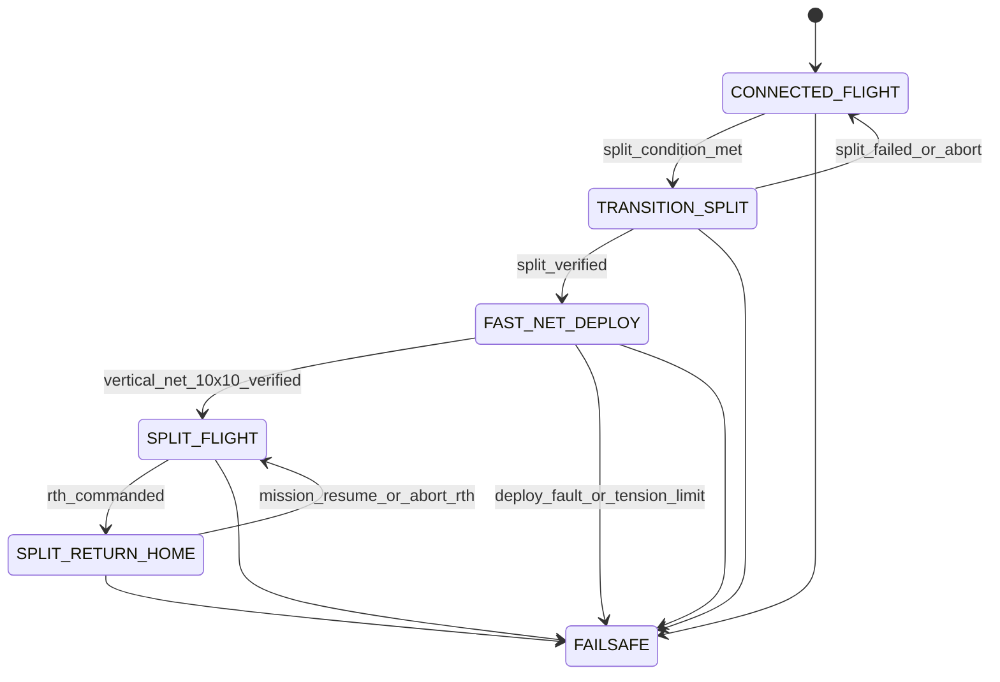

# Connected + Split Swarm Flight Architecture (x500 2x2)

## 1. Goal
Design a mission architecture where 4 drones can:

1. Fly physically connected as one rigid vehicle for specific mission segments.
2. Separate in flight-safe conditions.
3. Immediately maneuver after separation to a vertical net-deploy structure that stretches a shared net to 10 m x 10 m as fast as safely possible.
4. Fly that structure to a mission location and, when commanded, return home as independent drones.

This document is architecture-only (no code changes), focused on PX4 SITL + Gazebo workflows already used in this repository.

## 2. Core Concept
Treat this as a hybrid system with two vehicle topologies:

1. Connected topology (single rigid-body vehicle)
2. Split topology (4 independent vehicles in coordinated formation)

The key architectural decision is:

1. Connected mode is controlled as one vehicle-level controller.
2. Split mode is controlled as multi-agent coordinated controllers.
3. Transition logic is handled by a mission supervisor state machine with strict gates.

## 3. High-Level Layers

```mermaid
flowchart TD
  A[Mission Planner] --> B[Mission Supervisor / Mode Manager]
  B --> C1[Connected Flight Controller]
  B --> C2[Split Formation Controller]
  B --> C3[Transition Manager]

  C1 --> D1[Vehicle Command Interface]
  C2 --> D2[Swarm Command Interface]
  C3 --> D3[Undock Sequencer]

  D1 --> E[PX4 Instance(s)]
  D2 --> E
  D3 --> E

  E --> F[Gazebo Physics + Connection Model]
  F --> G[State Estimation / Health Monitor]
  G --> B
```

## 4. Operating Modes

### Mode A: CONNECTED_FLIGHT
Use when mechanical links are attached and healthy.

Control abstraction:

1. One rigid body state (position, velocity, attitude, angular rates).
2. One trajectory generator.
3. One actuator allocation over all available connected rotors.

PX4 mapping idea:

1. Single PX4 instance with a connected airframe model (already aligned with your 12-rotor approach).
2. One IMU/GNSS/baro fusion stream representing the combined body.
3. One setpoint source from mission supervisor.

Typical mission segments:

1. Cooperative heavy-lift translation.
2. High-stability cruise to waypoint.
3. Energy-efficient transit where shared frame is beneficial.

### Mode B: SPLIT_FLIGHT
Use after successful separation and net deployment.

Control abstraction:

1. Four independent vehicle states.
2. Formation-level objective (shape + centroid + heading).
3. Per-drone local controllers with coordination constraints.

PX4 mapping idea:

1. Four PX4 instances (one per drone).
2. External formation supervisor publishes setpoints per drone.
3. Supervisor maintains structure (line, square, diamond, etc.).

Typical mission segments:

1. Area coverage.
2. Parallel inspection.
3. Obstacle-aware distributed motion.

### Mode D: FAST_NET_DEPLOY
Use immediately after split confirmation to stretch the net quickly.

Control abstraction:

1. Two drones climb and separate laterally to form the top edge of the net.
2. Two drones descend and separate laterally to form the bottom edge of the net.
3. Combined motion forms a vertical 10 m x 10 m wall.
4. Formation centroid is held near the split point (or a commanded anchor point).
5. Wall normal (facing direction) is commanded by mission heading.
6. A time-optimal trajectory is used with bounded acceleration/jerk and tension-aware safety limits.

Target geometry (relative to centroid in wall frame):

1. Top-left slot:    lateral -5 m, vertical +5 m
2. Top-right slot:   lateral +5 m, vertical +5 m
3. Bottom-left slot: lateral -5 m, vertical -5 m
4. Bottom-right slot:lateral +5 m, vertical -5 m

Deployment pattern:

1. Upper pair executes climb + lateral spread.
2. Lower pair executes descend + lateral spread.
3. Expansion is synchronized so net-tension asymmetry stays bounded.

Completion criteria:

1. All drones within position tolerance of assigned vertical-wall slots.
2. Relative velocity below settle threshold.
3. Net tension proxy within allowed band (not slack, not overload).
4. Wall orientation error below heading threshold.

### Mode C: TRANSITION_SPLIT (Connected -> Split)
Managed sequence with strict gating:

1. Reach transition zone and reduce speed.
2. Stabilize at low angular/linear rates.
3. Arm split-control channels while still connected.
4. Release connectors.
5. Verify physical separation (distance + force/constraint status).
6. Ramp authority from vehicle-level to per-drone controllers.
7. Enter FAST_NET_DEPLOY only after all checks pass.

### Mode E: SPLIT_RETURN_HOME
Use when commanded to return home after separation.

Control abstraction:

1. Keep split topology (no re-attach).
2. Maintain a defined return structure (for example: diamond or line abreast).
3. Drive the formation centroid to home while each drone tracks its assigned slot.

Typical mission segments:

1. Ordered retreat from target area.
2. Structured transit back to launch/home.
3. Coordinated arrival and landing sequencing.

## 5. Mission Supervisor State Machine



Recommended supervisor outputs:

1. Active mode.
2. Per-mode reference setpoints.
3. Health and gate status bitmask.
4. Abort reason and fallback mode.

## 6. Estimation Architecture

### Connected mode estimator

1. Estimate one rigid-body state.
2. Fuse central IMU + GNSS + baro + mag.
3. Monitor structural stress proxies (if available) and vibration.

### Split mode estimator

1. Each drone runs its own estimator.
2. Supervisor consumes each drone pose and velocity.
3. Formation estimator computes centroid, dispersion, relative pose errors.

### Transition estimator requirements

1. Reliable relative position among drones near split window, rapid net deployment, and return-home structure changes.
2. Confidence metric for "separated" event, vertical-wall 10x10 slot convergence quality, and slot-hold quality in split mode.
3. Time-synchronized state snapshots during authority handover.

## 7. Control Responsibilities by Layer

### Vehicle-level (connected)

1. Track global position/attitude as a single craft.
2. Handle disturbance rejection on combined inertia.
3. Allocate thrust/torque to connected rotors.

### Formation-level (split)

1. Track formation centroid trajectory.
2. Track shape constraints (inter-drone offsets).
3. During FAST_NET_DEPLOY, prioritize minimum-time vertical-wall expansion to 10x10 within acceleration/jerk/tension envelopes.
4. Provide collision buffers and obstacle-aware deformation rules.

### Drone-level (split)

1. Track assigned local setpoint.
2. Run local failsafe (battery, link, estimator quality).
3. Hold assigned structure slot or execute independent RTL on supervisor command.

## 8. Transition Gate Conditions (Minimum Set)

For CONNECTED -> SPLIT:

1. Airspeed/groundspeed below threshold.
2. Attitude rates below threshold.
3. Position error below threshold.
4. No active actuator/sensor faults.
5. Formation channels healthy for all members.
6. Explicit operator/mission authorization.

For FAST_NET_DEPLOY -> SPLIT_FLIGHT:

1. Vertical 10x10 wall geometry achieved within defined tolerance.
2. Net-tension proxy inside nominal operating range.
3. Relative speeds settled below threshold.
4. Collision separation margins maintained throughout expansion.
5. Top pair altitude and bottom pair altitude satisfy wall-height threshold.

For SPLIT_FLIGHT -> SPLIT_RETURN_HOME:

1. Return-home command asserted by operator/mission logic.
2. Home position available and valid for all members.
3. Formation health above minimum threshold (or degrade profile selected).
4. Geofence/airspace constraints validated for return corridor.
5. Each member acknowledges return slot assignment.

## 9. Failsafe Strategy

Define deterministic fallback by mode:

1. If connected mode fails before split: land connected (preferred) or controlled hover + emergency split only if structure risk is high.
2. If split transition fails: abort release and return to connected mode.
3. If rapid net deployment violates tension/collision limits: freeze expansion, switch to safe intermediate geometry, then retry or abort mission.
4. If one drone degrades in split mode: switch to degraded formation profile, then mission abort or distributed RTL.
5. If supervisor link is lost: each drone executes local autonomous failsafe policy.

## 10. Simulation Representation

For architecture validation in Gazebo:

1. Connected phase: use one connected model (rigid-body approximation).
2. Split phase: swap to 4 x500 instances or run a parallel scenario focused on split-only behavior.
3. Transition fidelity options:
   - Low fidelity: event-based switch between connected and split scenarios.
   - Medium fidelity: temporary constraints/joints and scripted detach.
   - High fidelity: explicit connector mechanics + force limits + lock states.

Pragmatic path:

1. Start with low-fidelity mission/state-machine validation.
2. Add medium-fidelity transition mechanics.
3. Add high-fidelity connector dynamics after control logic is stable.

## 11. Recommended Implementation Order (When You Decide to Code)

1. Implement mission supervisor state machine and mode APIs.
2. Validate connected-only mission segments.
3. Validate split-only formation missions.
4. Implement transition gates and abort paths.
5. Add simulated connector state feedback.
6. Tune transitions and failsafe timing.

## 12. KPIs to Evaluate

1. Transition success rate (% successful split).
2. Net deployment time from split confirmation to validated vertical 10x10 geometry.
3. Max attitude excursion during transitions and rapid deployment.
4. Formation error RMS in split mode.
5. Connected mode trajectory tracking error.
6. Return-home structure integrity (slot error + spacing violations).
7. Abort-to-stable time after any gate failure.
8. Energy use per mission segment (connected vs split).

## 13. Practical Notes for Your Current PX4 Setup

1. Your current swarm launcher and world are a good base for split-mode experiments.
2. A connected-model path (single PX4 instance) is the right abstraction for rigidly attached flight segments.
3. The main architectural risk is not steady connected flight; it is safe and deterministic transition management.

## 14. Summary

The system should be designed as a mode-managed hybrid controller, not as one monolithic controller:

1. Connected mode = one vehicle controller.
2. Fast net deployment mode = minimum-time safe expansion to a vertical 10x10 wall geometry.
3. Split mode = coordinated multi-vehicle controller.
4. Transition manager = the safety-critical bridge between them.
5. Return home is executed in split topology (no reconnect path).

If this architecture matches your intent, the next step is to define the exact mode interface contract (inputs, outputs, and gate signals) before writing implementation code.
